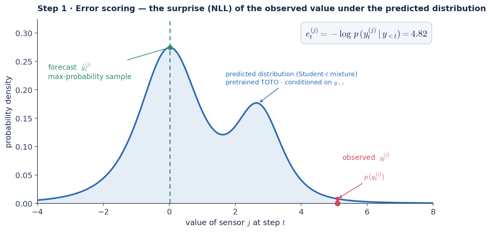
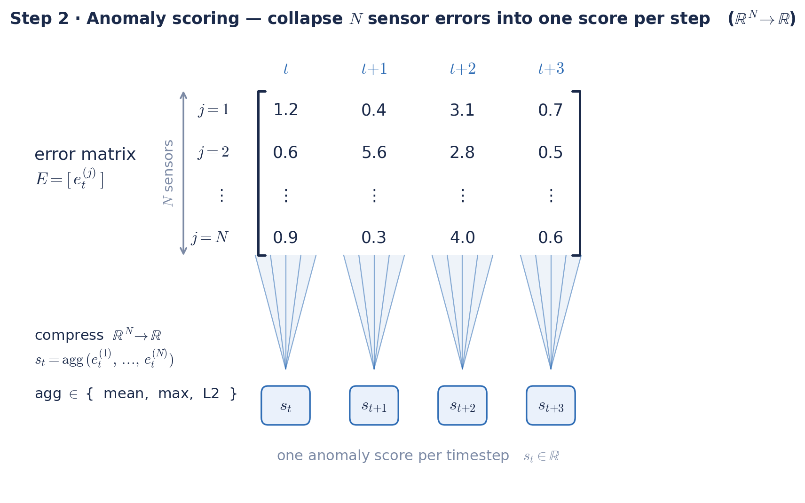
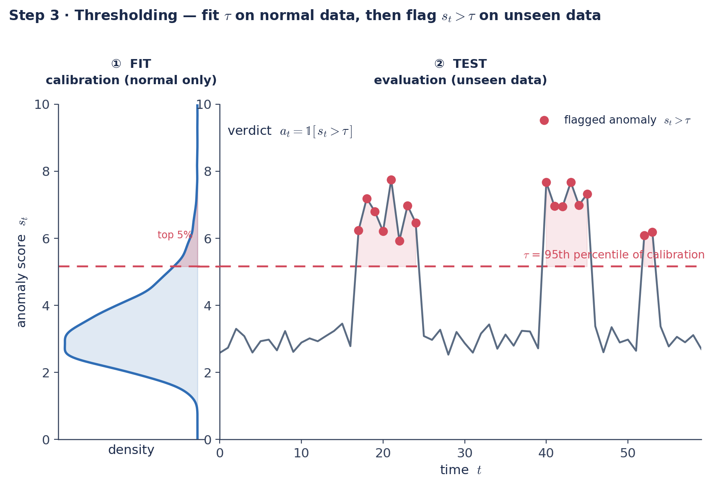

# TOTO Anomaly Detection

This module extends TOTO (Time Series Optimized Transformer for Observability) from a forecasting foundation model into a **zero-shot anomaly detection system**. TOTO was pretrained on **one trillion observability data points** — infrastructure, application, and cloud metrics — learning rich representations of normal operational behavior. The core insight: if it can accurately predict normal behavior, then large prediction errors flag deviations from it — anomalies — letting us catch previously unseen ones **without task-specific training**.

---

## From forecasting to anomaly detection

TOTO is a **forecasting foundation model**: it predicts what every sensor should do next, and we never retrain it. We turn that forecasting skill into a zero-shot anomaly detector in three moves: **score the surprise, collapse it to one number per timestep, then draw the line using only normal data.**

### ① Error scoring



**Figure 1.** TOTO outputs a **mixture of Student-T distributions** (24 components) for each time-series variate at every step, conditioned on the recent history. A point forecast is simply the **mode**, the most-probable value, of that output distribution. For anomaly detection, though, we are not after the forecast: we want to judge how anomalous an *observed* value is. We score each actual observation by its negative log-likelihood under the predicted distribution, $e_t^{(j)} = -\log p\!\left(y_t^{(j)} \mid y_{<t}\right)$ — the per-variate **error score**. A high score means the observation had low probability (high surprise); a low score means it landed where TOTO expected it.

### ② Error aggregation



**Figure 2.** Step 1 produces an **$N \times T$ matrix of error scores** $E = [\,e_t^{(j)}\,]$ — one entry per variate $j$ per timestep $t$. But anomaly detection is **per-timestep binary classification**: each timestep needs a single anomaly/normal label. Before we can threshold, we must therefore collapse each timestep's $N$ variate-errors into a single **anomaly score** $s_t$ — a step called **error aggregation**, an $\mathbb{R}^N \rightarrow \mathbb{R}$ compression that should preserve as much of the anomaly signal as possible. This is genuinely hard, because how an anomaly manifests is domain-dependent: a single rogue sensor calls for **max**, a system-wide shift for **mean**, with **L2** (the detector's default) in between. 

### ③ Thresholding



**Figure 3.** With one anomaly score per timestep, detection reduces to a single comparison: flag any step whose score exceeds a threshold $\tau$, i.e. $a_t = \mathbb{1}[\,s_t > \tau\,]$. Because we want to catch **unseen** anomalies, we never model the anomalies themselves; we model normal operation and flag whatever deviates. That is what makes the method **zero-shot**: In this figure, $\tau$ is fit as the **95th percentile of calibration scores from normal data only**. Threshold choice has an outsized effect on measured performance, so benchmarks often sidestep it with **AUROC**, a threshold-free metric. However, any real deployment has to commit to a $\tau$.

## What this codebase adds

TOTO is as a *forecasting* model; this repository adds the thin layer that turns it into a **zero-shot multivariate anomaly detector** — no training, no labels. The `toto/anomaly_detection/` module implements the three steps above as a small, reusable API:

- **`NLLScorer`** — per-variate negative-log-likelihood over a sliding context window (*error scoring*).
- **`AnomalyDetector`** — `fit` / `detect` / `score` with pluggable aggregation (`l2`, `mean`, `max`, `sum`, `topk`) (*aggregation*).
- **`ThresholdEstimator`** — thresholds from normal data only, with no anomalies seen (`percentile`, `mean_std`, `mad`) (*thresholding*).

Around it sit reproducible **preprocessing** (SWaT, SMD), **detection**, and **AUROC** scripts, so the whole pipeline runs end-to-end on a benchmark with one command.

**The experiment.** We ran a first zero-shot evaluation on two standard MVTS benchmarks — SWaT (industrial control) and SMD (server monitoring). The honest summary: forecasting-error detection transfers to both at the *scoring* stage — SWaT ranks anomalies at AUROC ≈ 0.86, and on SMD the per-variate error carries anomaly signal on every machine — but the failures live in the steps wrapped around the model. On SWaT the bottleneck is *thresholding* (a strong ranker crippled by distribution shift); on SMD it is *error aggregation* (a naive mean/max over 38 differently-scaled variates scores at chance, while a scale-aware aggregation recovers AUROC ≈ 0.73). The recurring lesson is that aggregation and thresholding, not the model, decide whether detection works. Full method, numbers, and analysis are in [the blogpost](results/TOTO-4-AD-BLOGPOST.md).

**Try it on your data.** The detector is dataset-agnostic: hand it an anomaly-free calibration set and an evaluation set in `(batch, variates, timesteps)` form (see [Quick Start](#quick-start)) and it returns a per-timestep score and flag. I'd love to see TOTO-4-AD tested on *your* multivariate time-series anomaly detection datasets — if forecasting foundation models are going to generalize, that's how we find out.

---

## Quick Start

### Installation

```bash
# Install TOTO with anomaly detection support
pip install toto-ts

# Or install from source
git clone https://github.com/DataDog/Toto-4-AD.git
cd Toto-4-AD
pip install -e .
```

### Basic Usage — end to end

```python
import torch
from sklearn.metrics import roc_auc_score, f1_score
from toto.model.toto import Toto
from toto.anomaly_detection import AnomalyDetector

device = "cuda" if torch.cuda.is_available() else "cpu"

# 1. Load pretrained TOTO (no training / fine-tuning happens here)
toto = Toto.from_pretrained('Datadog/Toto-Open-Base-1.0')
toto.to(device)
toto.eval()

# 2. Load preprocessed data (see "Datasets & Preprocessing").
#    Each .pt holds 'series' (batch, variates, timesteps) and 'labels' (batch, timesteps).
cal  = torch.load('toto/data/preprocessed_datasets/swat/swat_train.pt', weights_only=False)
test = torch.load('toto/data/preprocessed_datasets/swat/swat_test.pt',  weights_only=False)

# 3. Build the detector
detector = AnomalyDetector(
    model=toto.model,
    context_length=512,
    aggregation='mean',          # 'mean' | 'max' | 'l2' | 'sum' | 'topk'
    threshold_percentile=95.0,
)

# 4. Fit tau on the anomaly-free calibration set
detector.fit(cal['series'].to(device), stride=32)
print(f"Threshold tau: {float(detector.threshold):.4f}")

# 5. Detect on the evaluation set -> per-timestep flags + scores, both (batch, T_out)
detect_stride = 1
is_anomaly, scores = detector.detect(
    test['series'].to(device), stride=detect_stride, return_scores=True
)

# 6. Get results. Output index i corresponds to timestep (context_length + i*stride),
#    so labels must be offset by context_length — not labels[:, :T_out].
ctx, T_out = 512, scores.shape[1]
idx = ctx + torch.arange(T_out) * detect_stride
y_score = scores.flatten().cpu().numpy()
y_pred  = is_anomaly.flatten().cpu().numpy()
y_true  = test['labels'][:, idx].flatten().cpu().numpy()

print(f"AUROC (threshold-free): {roc_auc_score(y_true, y_score):.3f}")
print(f"F1 @ tau:               {f1_score(y_true, y_pred):.3f}")
# is_anomaly = binary predictions, scores = continuous anomaly scores
```

> For SMD (28 independent machines) fit one threshold **per machine** and compute AUROC per machine — see `compute_per_machine_auroc.py`. A single global threshold mixes error scales that are not comparable across machines.

---

## Datasets & Preprocessing

We evaluate on two benchmark multivariate time series anomaly detection datasets:

> **Terminology note**: This is a *zero-shot* setup — TOTO is never trained or fine-tuned on these datasets. The files named `*_train.pt` / `*_test.pt` are **not** a supervised train/test split. The "train" file is an **anomaly-free calibration set** used only to set the detection threshold; the "test" file is the **anomaly-containing evaluation set**. The labels below ("Calibration set" / "Evaluation set") refer to these dataset partitions, not to any model training.

### 1. SWaT (Secure Water Treatment)

**Domain**: Industrial control systems
**Sensors**: 51 variates (flow rates, tank levels, valve states)
**Calibration set (normal)**: 7 days normal operation (496,800 timesteps)
**Evaluation set (with anomalies)**: 4 days with 36 cyber-physical attacks (449,919 timesteps, ~12% anomalous)
**Anomalies**: Manipulated sensor readings, unauthorized valve controls

**Preprocess SWaT:**
```bash
# Download SWaT dataset and extract to toto/data/SWaT.A1 & A2_Dec 2015/
# Then preprocess:
python preprocess_swat.py \
    --data_dir "toto/data/SWaT.A1 & A2_Dec 2015/Physical" \
    --output_dir toto/data/preprocessed_datasets/swat \
    --downsample 1

# Output:
#   - swat_train.pt (normal operations)
#   - swat_test.pt (with attacks)
#   - swat_train_metadata.csv
#   - swat_test_metadata.csv
```

### 2. SMD (Server Machine Dataset)

**Domain**: Server monitoring
**Sensors**: 38 variates per machine (CPU, memory, disk I/O, network)
**Machines**: 28 independent servers
**Calibration set (normal)**: ~23,687 timesteps per machine (all normal)
**Evaluation set (with anomalies)**: ~23,687 timesteps per machine (~4.3% anomalous)
**Anomalies**: Hardware failures, configuration errors, resource exhaustion

**Preprocess SMD:**
```bash
# Download SMD dataset and extract to toto/data/ServerMachineDataset/
# Then preprocess:
python preprocess_smd.py \
    --data_dir toto/data/ServerMachineDataset \
    --output_dir toto/data/preprocessed_smd_1x \
    --downsample 1

# Output:
#   - smd_train.pt (28 machines, normal)
#   - smd_test.pt (28 machines, with anomalies)
#   - smd_train_metadata.json
#   - smd_test_metadata.json
```

---

## Running Anomaly Detection

### SWaT Detection

```bash
# Mean aggregation (system-wide anomalies)
python run_swat_anomaly_detection.py \
    --data_dir toto/data/preprocessed_datasets/swat \
    --output_dir toto/results/swat_mean \
    --aggregation mean \
    --context_length 512 \
    --threshold_percentile 95.0 \
    --fit_stride 32 \
    --detect_stride 1

# Max aggregation (localized anomalies)
python run_swat_anomaly_detection.py \
    --data_dir toto/data/preprocessed_datasets/swat \
    --output_dir toto/results/swat_max \
    --aggregation max \
    --detect_stride 1

# Results saved to:
#   - swat_detection_results.json (metrics: precision, recall, F1, AUROC)
#   - swat_anomaly_detection_results.png (visualization)
#   - swat_score_distribution.png (score histogram)
```

### SMD Detection

```bash
# Mean aggregation
python run_smd_anomaly_detection.py \
    --data_dir toto/data/preprocessed_smd_1x \
    --output_dir toto/results/smd_mean \
    --aggregation mean \
    --context_length 512 \
    --threshold_percentile 95.0 \
    --fit_stride 32 \
    --detect_stride 32 \
    --plot_machines 0 5 10

# Max aggregation
python run_smd_anomaly_detection.py \
    --data_dir toto/data/preprocessed_smd_1x \
    --output_dir toto/results/smd_max \
    --aggregation max \
    --detect_stride 32 \
    --plot_machines 0 5 10

# Results saved to:
#   - smd_detection_results.json (overall + per-machine metrics)
#   - smd_machine_{0,5,10}_anomaly_detection.png
#   - smd_machine_{0,5,10}_score_distribution.png
#   - Precision, Recall, F1 outputted in terminal
```

---

## Threshold-Agnostic Evaluation: AUROC

**Problem**: Threshold-based metrics (Precision, Recall, F1) depend heavily on the chosen threshold. Distribution shift between calibration and evaluation data can make fixed thresholds ineffective.

**Solution**: AUROC (Area Under ROC Curve) measures the model's ability to **rank** anomalies above normal data, independent of any threshold choice.

### Computing AUROC

```bash
# SWaT with mean aggregation
python compute_auroc.py swat mean

# SWaT with max aggregation
python compute_auroc.py swat max

# SMD with mean aggregation
python compute_auroc.py smd mean

# SMD with max aggregation
python compute_auroc.py smd max

# Results saved to:
#   - toto/results/auroc/{dataset}_{aggregation}_auroc.json
```

### Interpreting AUROC

- **AUROC = 1.0**: Perfect ranking—all anomalies scored higher than all normal points
- **AUROC = 0.5**: Random performance—model cannot distinguish anomalies from normal
- **AUROC < 0.5**: Inverted ranking—model scores anomalies lower than normal (systematic failure)

**Diagnostic Value**: AUROC helps localize *where* detection fails:
- **High AUROC, Low F1**: thresholding failure → try adaptive thresholding (this is SWaT).
- **Aggregated AUROC ≈ 0.5 or below**: could be a genuine ranking failure *or* an aggregation artifact. Before concluding the model is blind, check the per-variate / per-dimension signal — on SMD the aggregated score was at/below chance while the per-variate signal was strong, i.e. an **aggregation** failure, not a model failure.

---

## Results Summary

### SWaT: Strong Ranking, Threshold Challenges

| Aggregation | AUROC | Precision | Recall | F1 | Interpretation |
|-------------|-------|-----------|--------|----|----|
| Mean | **86.3%** | 12.2% | 97.8% | 21.7% | ✓ Model ranks anomalies correctly |
| Max | **80.0%** | 11.8% | 97.2% | 21.0% | ⚠ Distribution shift causes threshold mismatch |

**Key Findings**:
- TOTO successfully learned transferable patterns from observability data to industrial control systems
- High AUROC demonstrates zero-shot transfer capability
- Low F1 due to distribution shift between calibration and evaluation sets (threshold too low)
- **Conclusion**: Threshold-setting failure, not ranking failure

### SMD: Signal Present, Lost in Aggregation

Per-machine AUROC, macro-averaged over the 28 machines:

| Aggregation (over 38 variates) | AUROC | Interpretation |
|-------------|-------|----|
| Raw mean | 48.3% | naive aggregation — at chance |
| Raw max | 30.3% | naive aggregation — below chance (dominated by per-variate scale) |
| Robust per-variate normalized (median/IQR) mean | **69.0%** | scale-aware, zero-shot |
| Robust per-variate normalized (median/IQR) max | **72.9%** | scale-aware, zero-shot |
| Best single variate per machine | 93% | upper bound (label-informed, not deployable) |

**Key Findings**:
- The standard pipeline (raw mean/max) scores at or below chance — but this is an **error-aggregation** failure, not a model failure.
- Using SMD's per-dimension labels: TOTO's error carries anomaly signal on **all 28 machines** (best-variate AUROC > 0.7), and it lands on the genuinely-affected variates (+0.62σ vs +0.13σ for unaffected).
- Raw aggregation destroys that signal because the 38 variates have incomparable error scales; `max` is captured by the chronically-noisiest, anomaly-irrelevant variate. Robustly normalizing each variate against its own typical level (median/IQR, still zero-shot) recovers detection to **69–73% AUROC on 24/28 machines** (the normalize-then-aggregate scheme used by GDN (Deng and Hooi, AAAI 2021)).
- A residual ~21% of anomalies produce no forecast error at all — a genuine scoring blind spot.
- **Conclusion**: the failure is in the aggregation step and is largely fixable, not a fundamental inability of TOTO to detect SMD anomalies.

For the full analysis see [the blogpost](results/TOTO-4-AD-BLOGPOST.md).
---

## Design Choices & Trade-offs

### Error Aggregation Strategies

**Mean Aggregation**: $s_t = \frac{1}{M} \sum_{i=1}^M e_t^{(i)}$
- Assumes system-wide anomalies affecting multiple sensors
- Smooth, stable scores less sensitive to noise
- Can dilute localized anomalies
- **Best for**: Tightly coupled systems (SWaT: AUROC 86.3%)

**Max Aggregation**: $s_t = \max_i e_t^{(i)}$
- Detects sensor-specific anomalies
- High sensitivity to localized failures
- More prone to false positives from noise
- **Best for**: Independent components where single failures matter

### Threshold Selection Methods

**95th Percentile (Default)**:
- Rationale: Upper bound of "normal variation" observed in calibration data
- Conservative: Allows 5% of calibration scores to exceed threshold (accounts for noise)
- Limitation: Assumes calibration and evaluation distributions match

**Alternative Methods** (available in module):
- Mean + k*std: Statistical outlier detection
- Median Absolute Deviation (MAD): Robust to outliers
- Adaptive online thresholds: Update threshold as distribution shifts (future work)
